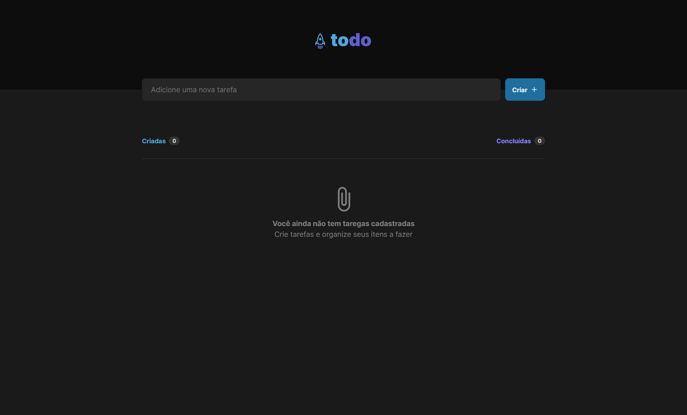
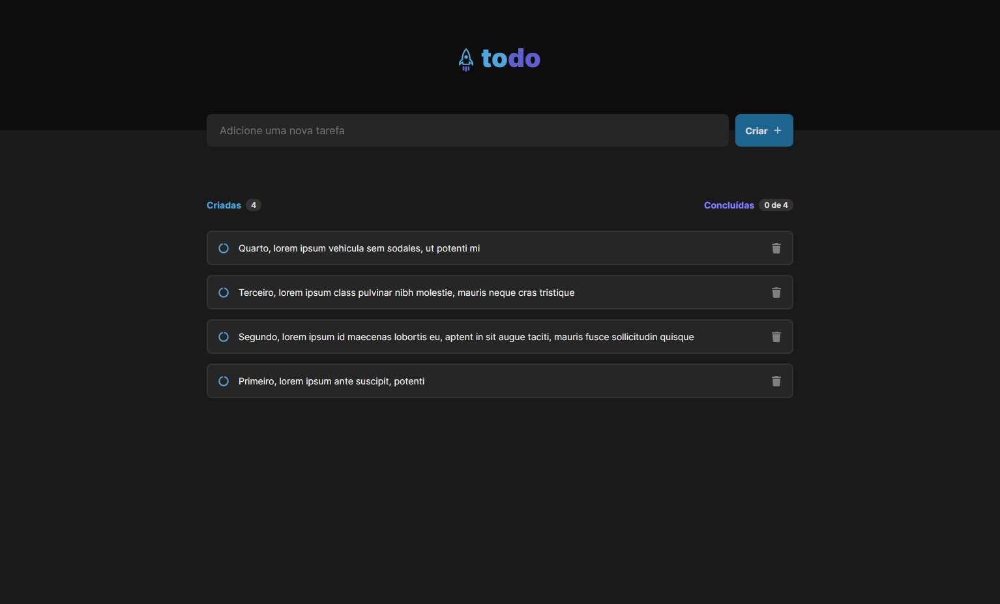
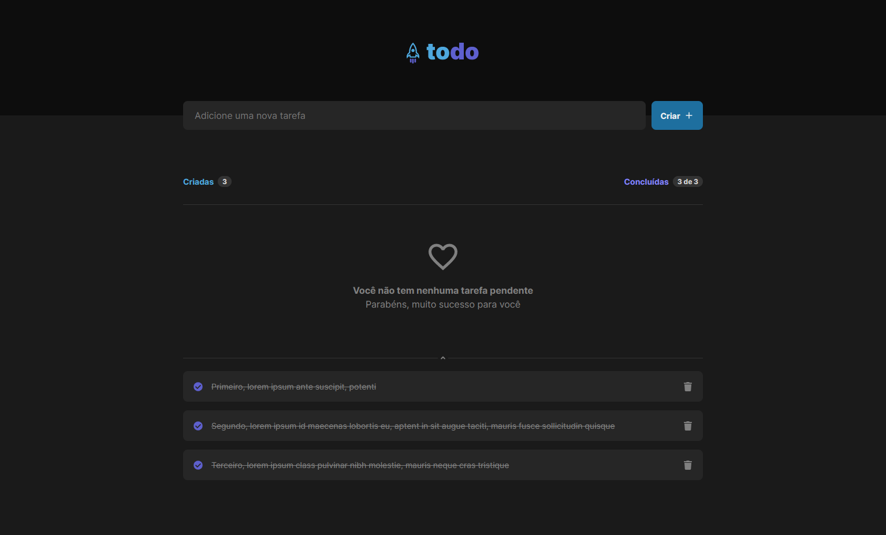
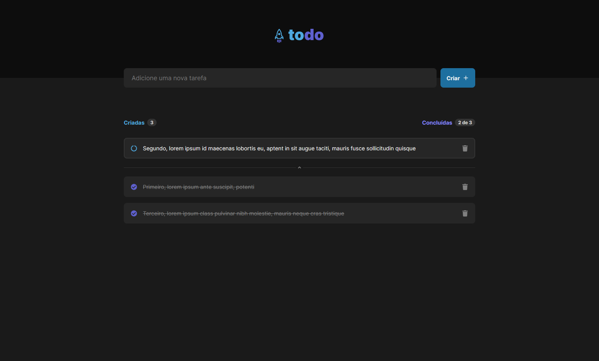
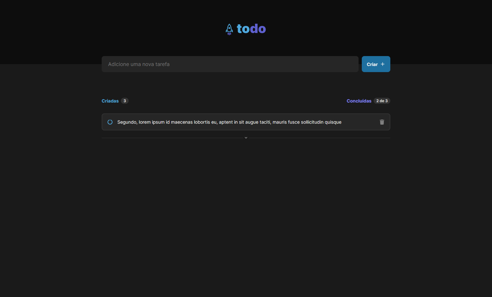

# Ignite Feed - 2022
Nesse desafio foi desenvolvido uma aplicação de controle de tarefas no formato de to do list com as seguintes funcionalidades:
  * Adicionar uma nova tarefa;
  * Marcar e desmarcar uma tarefa como concluída;
  * Remover uma tarefa da listagem;
  * Mostrar o progresso de conclusão das tarefas.

#reactjs #typescript #styledcomponents #vite #localStorage #reactIcons #uuid #component #hook #eslint #dev #frontend #rocketseat

Clique <a target="_blank" style="font-weight: bold; color: inherit; text-decoration: none" href="https://ignite2022desafio1.vercel.app/">aqui</a> para acessar o site em produção.

## Executando a aplicação
Utilize o comando abaixo para instalar as dependências necessárias:
```bash
yarn
```

Utilize o atalho `yarn dev` para executar a aplicação ou o seguinte comando:
```bash
yarn vite
```

O frontend será executado na porta `5173`.

## Imagens
### Tela principal sem tarefas


### Tela principal com tarefas pendente


### Tela principal com tarefas concluídas


### Tela principal com tarefas pendente e concluídas


### Tela principal com tarefas pendente e concluídas arquivadas

