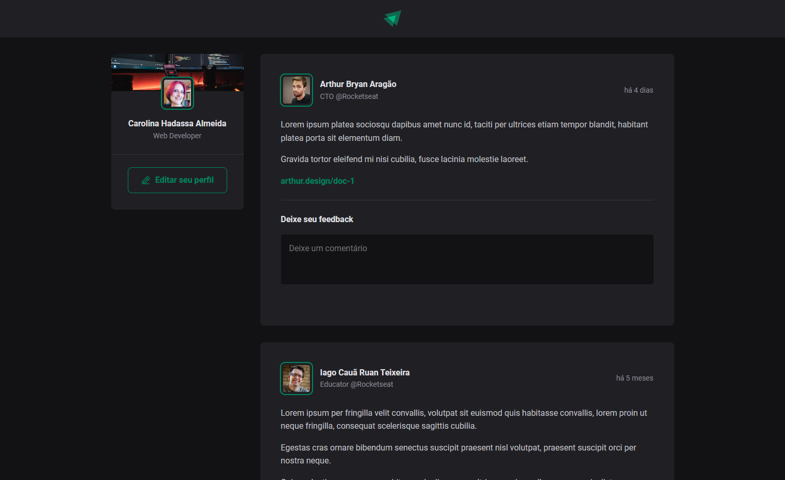
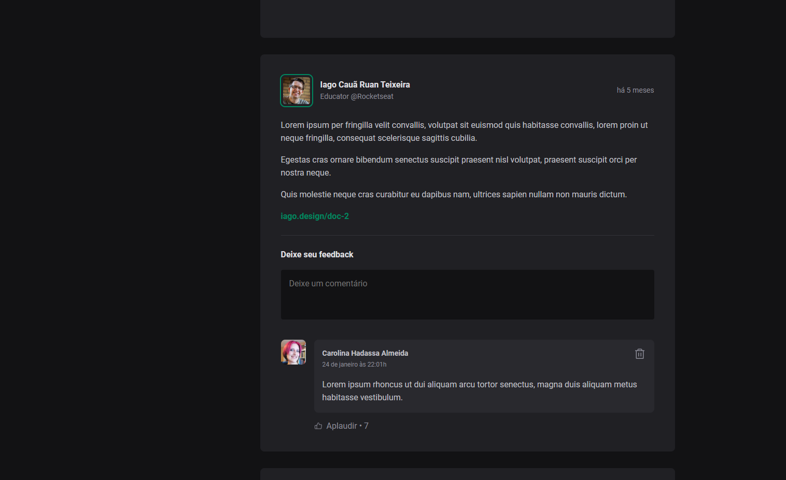

# Ignite Feed - 2022
Nesse módulo foi criado uma aplicação React JS utilizando o Vite e aprendendo sobre os conceitos mais importantes do React JS, entre eles estão componentização, propriedades, estados, imutabilidade e hooks, além de aplicar o TypeScript no projeto para adicionar tipagem estática à aplicação.

A aplicação é uma página onde outros usuários podem realizar postagens de texto e o usuário consegue realizar comentários.

#reactjs #typescript #cssmodule #vite #datefns #phosphorreact #dev #frontend #rocketseat

## Executando a aplicação
Utilize o comando abaixo para instalar as dependências necessárias:
```bash
yarn
```

Utilize o atalho `yarn dev` para executar a aplicação ou o seguinte comando:
```bash
yarn vite
```

O frontend será executado na porta `5173`.

## Imagens
### Tela principal sem comentário


### Tela principal com comentários

