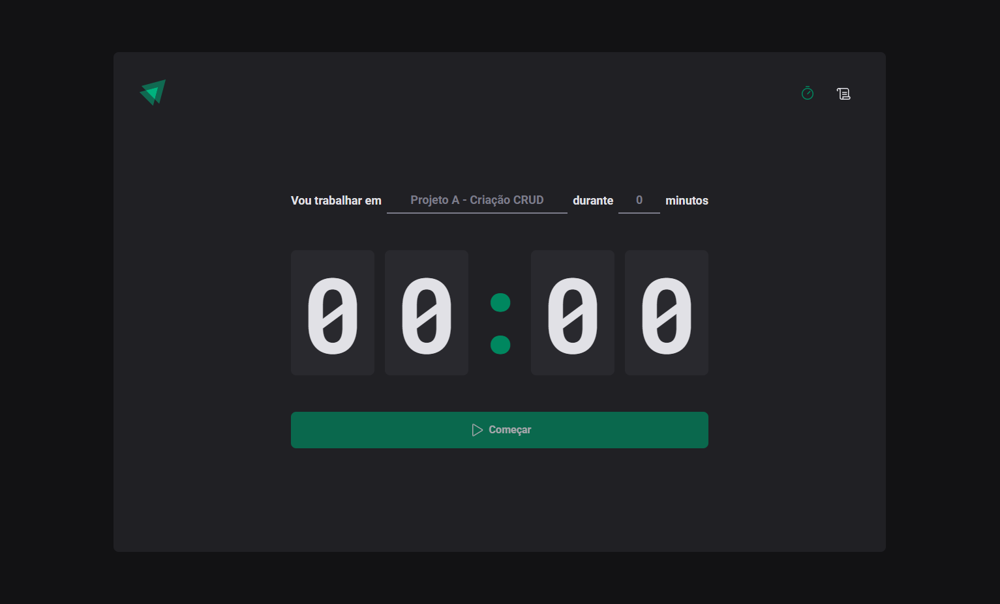
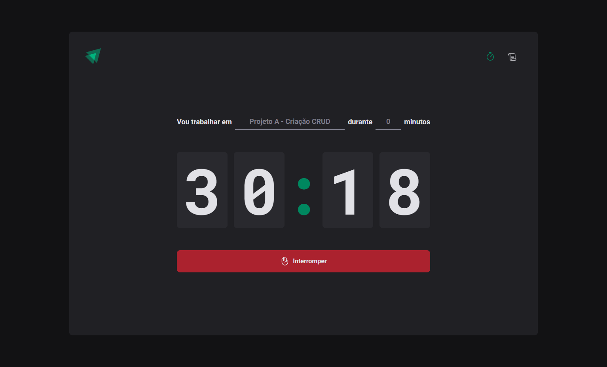
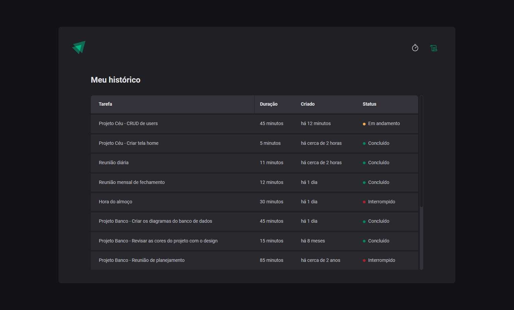

# Ignite Timer - 2022
Nesse módulo foi construído uma aplicação completa com roteamento e diversos conceitos importantes do ecossistema React como ContextAPI, useReducer, immer e muito mais.

A aplicação é uma implementação da técnica de foco Pomodoro com uma segunda página mostrando um histórico de ciclos já criado.

## Executando a aplicação
Utilize o comando abaixo para instalar as dependências necessárias:
```bash
yarn
```

Utilize o atalho `yarn dev` para executar a aplicação ou o seguinte comando:
```bash
yarn vite
```

O frontend será executado na porta `5173`.

## Imagens
### Tela principal


### Ciclo em execução


### Histórico de ciclos

